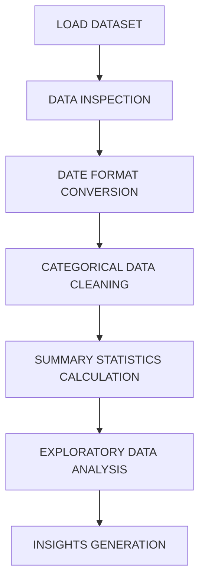
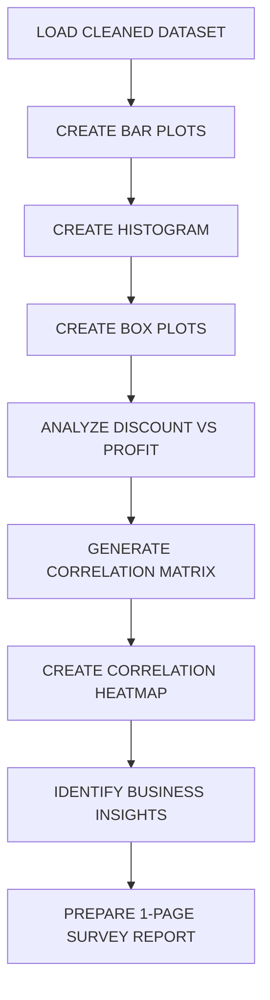
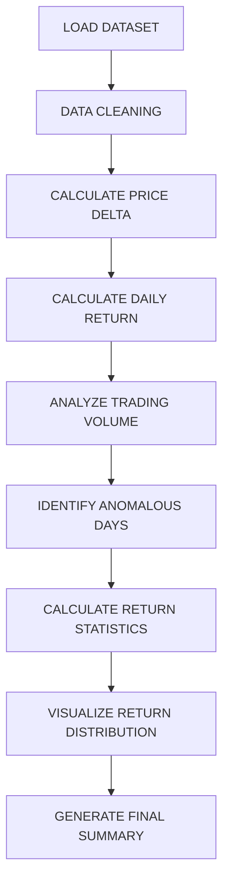

# WEEK 1: SUPERSTORE SALES DATA UNDERSTANDING, CLEANING & EXPLORATORY ANALYSIS

## DESCRIPTION

This task focuses on understanding, cleaning, and analyzing the Superstore Sales dataset using Python and Pandas.

## OBJECTIVES

* Load the dataset using Pandas.
* Inspect the dataset using `head()`, `info()`, and `describe()`.
* Convert Order Date and Ship Date columns into proper datetime format.
* Clean and standardize categorical attributes such as Category, Sub-Category, and Segment.
* Calculate initial summary statistics for numerical attributes.

## WORKFLOW

# WEEK 2: RETAIL SALES VISUALIZATION, RELATIONSHIP ANALYSIS & BUSINESS INSIGHTS

## DESCRIPTION

This task focuses on visualizing retail sales and analyzing relationships between Sales, Profit, Discount, Quantity, and other numerical attributes using Python, Matplotlib, and Seaborn.

## OBJECTIVES

* Create bar plots, histograms, and box plots to visualize sales and profit.
* Analyze the relationship between Discount and Profit.
* Identify discount levels that negatively affect profitability.
* Generate a correlation heatmap for numerical attributes.
* Analyze relationships between Sales, Profit, Discount, and Quantity.
* Generate meaningful business insights from the visualizations.
* Prepare the findings as a 1-page survey report.

## WORKFLOW

## VISUALIZATIONS

* **Sales by Category** – Bar Plot
* **Sales Distribution** – Histogram
* **Profit by Category** – Bar Plot
* **Sales Distribution by Category** – Bar Plot
* **Profit Variation Across Categories** – Box Plot
* **Profit Distribution** – Box Plot
* **Discount vs Profit** – Scatter Plot
* **Correlation Heatmap** – Heatmap

## BUSINESS INSIGHTS

* Analyze the impact of discounts on profitability.
* Compare sales and profit across different categories.
* Identify relationships between numerical attributes.
* Identify strong and weak-performing categories.
* Support better pricing and discount decisions using data analysis.

## KEY OUTCOMES

* Visualized retail sales and profit using different plots.
* Analyzed the distribution of Sales and Profit.
* Compared sales and profit across different categories.
* Analyzed the relationship between Discount and Profit.
* Identified discount levels that may negatively affect profitability.
* Generated a correlation heatmap for numerical attributes.
* Identified important relationships between Sales, Profit, Discount, and Quantity.
* Extracted meaningful business insights.
* Prepared the findings as a 1-page survey report.

# WEEK 3: STOCK MARKET PRICE, RETURN & TRADING VOLUME ANALYSIS

## DESCRIPTION

This task focuses on cleaning and analyzing stock market data using Python and Pandas. The dataset is analyzed to calculate daily price changes and percentage returns, study trading volume trends, identify anomalous trading days, and summarize stock return distributions using statistical measures.

## OBJECTIVES

* Load the stock market dataset using Pandas.
* Clean the **Open, High, Low, Close, and Volume** attributes.
* Calculate daily price delta using **Close - Open**.
* Calculate daily percentage return.
* Calculate the 5-day moving average of trading volume.
* Identify anomalous trading days based on trading volume.
* Calculate mean, median, variance, and standard deviation of stock returns.
* Visualize trading volume trends and daily return distribution.
* Generate a final summary of stock returns and trading activity.

## WORKFLOW

## VISUALIZATIONS

* **Trading Volume Trend** – Line Chart
* **5-Day Moving Average of Volume** – Line Chart
* **Anomalous Trading Days** – Line + Scatter Plot
* **Daily Return Distribution** – Histogram

## STATISTICAL ANALYSIS

* **Mean** – Average daily stock return.
* **Median** – Middle value of daily returns.
* **Variance** – Measures the spread of daily returns.
* **Standard Deviation** – Measures the volatility of daily returns.

## KEY ANALYSIS

* Analyze daily price changes using Open and Close prices.
* Measure daily percentage returns.
* Analyze trading volume trends using a 5-day moving average.
* Detect unusually high or low trading volume days.
* Analyze the distribution and variation of daily stock returns.
* Summarize stock return and trading volume characteristics.

## KEY OUTCOMES

* Successfully cleaned the stock market price and volume attributes.
* Calculated daily price delta using Open and Close prices.
* Calculated daily percentage returns.
* Analyzed trading volume using a 5-day moving average.
* Identified anomalous trading days using volume statistics.
* Calculated mean, median, variance, and standard deviation of stock returns.
* Visualized trading volume trends and daily return distribution.
* Generated a final summary of stock returns and trading activity.
