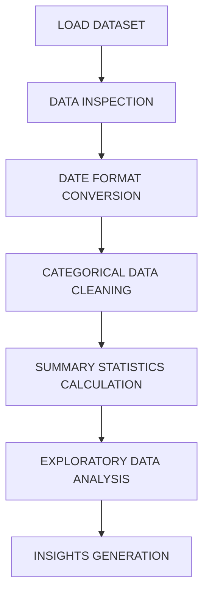
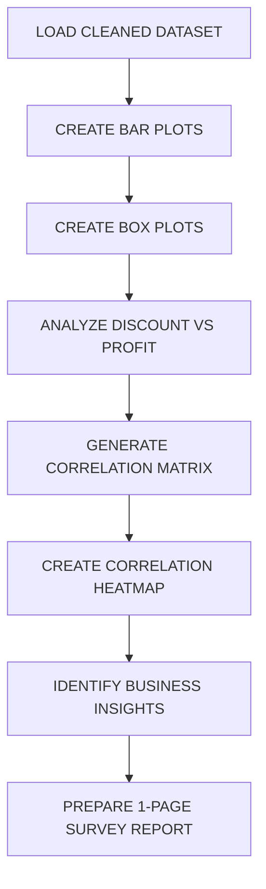

## WEEK 1: SUPERSTORE SALES DATA UNDERSTANDING, CLEANING & EXPLORATORY ANALYSIS

### DESCRIPTION

This task focuses on understanding, cleaning, and analyzing the Superstore Sales dataset using Python and Pandas.

### OBJECTIVES

- Load the dataset using Pandas.
- Inspect the dataset using `head()`, `info()`, and `describe()`.
- Convert Order Date and Ship Date columns into proper datetime format.
- Clean and standardize categorical attributes such as Category, Sub-Category, and Segment.
- Calculate initial summary statistics for numerical attributes.

### WORKFLOW

## WEEK 2: RETAIL SALES VISUALIZATION, RELATIONSHIP ANALYSIS & BUSINESS INSIGHTS

### DESCRIPTION

This task focuses on visualizing retail sales and analyzing relationships between Sales, Profit, Discount, Quantity, and other numerical attributes using Python, Matplotlib, and Seaborn.

### OBJECTIVES

- Create bar plots and box plots to visualize sales and profit.
- Analyze the relationship between Discount and Profit.
- Identify discount levels that negatively affect profitability.
- Generate a correlation heatmap for numerical attributes.
- Analyze relationships between Sales, Profit, Discount, and Quantity.
- Generate meaningful business insights from the visualizations.
- Prepare the findings as a 1-page survey report.

### WORKFLOW

### VISUALIZATIONS

- Bar Plot: Sales by Category
- Bar Plot: Profit by Category
- Box Plot: Sales Distribution
- Box Plot: Profit Distribution
- Scatter Plot: Discount vs Profit
- Correlation Heatmap

### BUSINESS INSIGHTS

- Analyze the impact of discounts on profitability.
- Compare sales and profit across different categories.
- Identify relationships between numerical attributes.
- Identify strong and weak-performing categories.
- Support better pricing and discount decisions using data analysis.

### KEY OUTCOMES

- Visualized retail sales and profit using different plots.
- Analyzed the relationship between Discount and Profit.
- Identified discount levels that may negatively affect profitability.
- Generated a correlation heatmap for numerical attributes.
- Identified important relationships between Sales, Profit, Discount, and Quantity.
- Extracted meaningful business insights.
- Prepared the findings as a 1-page survey report.
